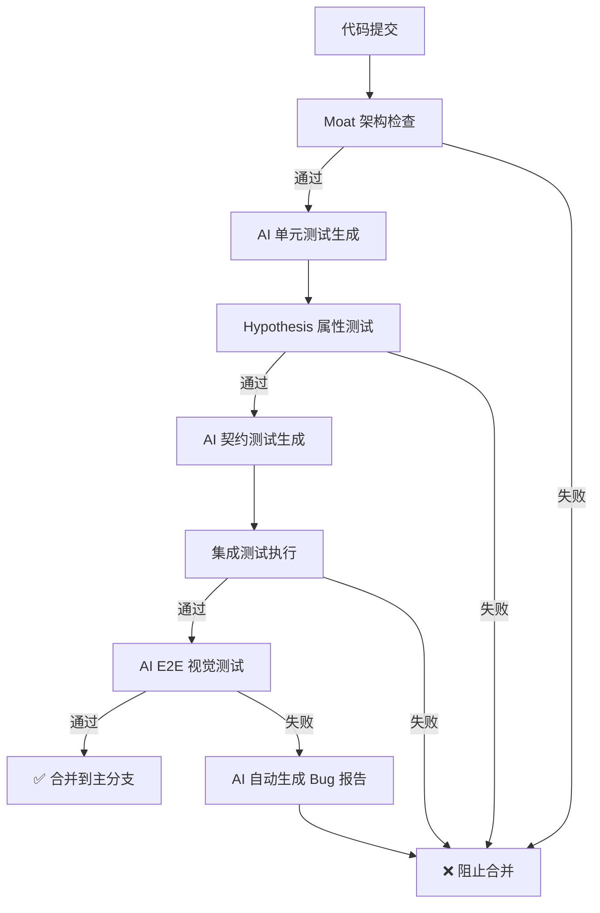

# 🤖 AI 工程化测试体系

> **定位**: Moat 的"功能与价值验证"扩展层
> **版本**: 1.0.0
> **与 Moat 的关系**: Moat 管"地基"，AI 测试体系管"装修"

---

## 📋 目录

1. [核心概念](#核心概念)
2. [架构分层](#架构分层)
3. [快速开始](#快速开始)
4. [配置说明](#配置说明)
5. [与 Moat 的协同](#与-moat-的协同)
6. [实施路线图](#实施路线图)
7. [最佳实践](#最佳实践)

---

## 核心概念

### 为什么需要 AI 测试体系？

Moat 专注于**架构完整性守护**，它不会检查：
- ❌ UI 功能是否正常
- ❌ 业务逻辑是否正确
- ❌ 用户界面交互
- ❌ 前端渲染问题

这些领域需要一套**AI 驱动的自动化测试体系**来覆盖。

### 核心原则

1. **职责解耦**: Moat 和 AI 测试体系各司其职，不重叠
2. **渐进式落地**: 从单元测试开始，逐步扩展
3. **AI 真正赋能**: 智能化测试生成，而非简单自动化
4. **成本可控**: 视觉测试只覆盖关键页面，不盲目扩张

---

## 架构分层

```
┌─────────────────────────────────────────────┐
│   UI/功能层 (AI 测试体系)                    │
│   - Playwright + GPT-4o 视觉断言             │
│   - AI Agent 自动化探索                       │
├─────────────────────────────────────────────┤
│   业务逻辑层 (AI 测试体系)                    │
│   - Hypothesis 属性测试                       │
│   - Pact 契约测试                              │
│   - pytest-bdd BDD 测试                       │
├─────────────────────────────────────────────┤
│   架构层 (Moat 负责)                          │
│   - 代码规范、模块拆分、复杂度                 │
│   - 导入错误、覆盖率监控、健康检查             │
└─────────────────────────────────────────────┘
```

### 职责边界

| 检查点 | Moat 职责 | AI 测试体系职责 |
|--------|-----------|----------------|
| **代码规范** | ✅ 语法、格式、注释 | ❌ 不涉及 |
| **架构合规** | ✅ 文件大小、模块拆分 | ❌ 不涉及 |
| **测试覆盖率** | ✅ 监控覆盖率，门禁控制 | ✅ 生成覆盖率缺口的具体测试 |
| **测试存在性** | ✅ 检查测试文件是否存在 | ✅ 如果缺失，自动生成测试代码 |
| **契约完整性** | ✅ 检查契约文件是否被误删 | ✅ AI 根据 API 变更自动更新契约 |
| **BDD 覆盖** | ✅ 检查关键路径是否有 `.feature` 文件 | ✅ AI 将 PRD 自动转换为 `.feature` |
| **业务逻辑** | ❌ 不涉及 | ✅ Pytest + Hypothesis 属性测试 |
| **UI 渲染** | ❌ 不涉及 | ✅ Playwright + GPT-4o 视觉断言 |
| **E2E 交互** | ❌ 不涉及 | ✅ AI Agent 自动化探索 |

---

## 快速开始

### 1. 安装依赖

```bash
# 单元测试
pip install pytest pytest-cov pytest-asyncio hypothesis pytest-mock

# 契约测试
pip install pact-python pytest-bdd requests-mock

# E2E 测试
playwright install chromium
```

### 2. 配置 Moat

确保 `.moat/config.json` 中启用了测试相关检查：

```json
{
  "project_name": "your-project",
  "check_on_commit": true,
  "python": {
    "framework": "fastapi"
  }
}
```

### 3. 定义关键业务路径

在 `ai_test_config.yml` 的 `bdd_tests.coverage.required_scenarios` 中定义必须覆盖的关键路径：

```yaml
bdd_tests:
  coverage:
    required_scenarios:
      - "用户注册流程"
      - "用户登录流程"
      - "支付流程"
      - "数据查询流程"
```

### 4. 运行测试

```bash
# 1. Moat 架构检查
moat verify

# 2. AI 单元测试生成（基于 Moat 发现的缺失）
moat test generate --type=unit --scope=missing

# 3. AI 集成测试生成
moat test generate --type=integration --scope=new-api

# 4. AI E2E 视觉测试
moat test e2e --ai-vision --browser=chromium

# 5. 完整验收流水线
moat test --all --ai-agent
```

---

## 配置说明

### 全局配置

```yaml
global:
  moat_integration:
    mode: "audit"  # audit | gatekeeper | advisory
    audit_responsibilities:
      - "check_test_coverage"            # 监控测试覆盖率
      - "verify_test_existence"          # 检查测试文件是否存在
      - "validate_contract_integrity"    # 验证契约文件完整性
      - "enforce_test_ticket"            # 强制执行"测试门票"机制
```

### 单元测试配置

```yaml
unit_tests:
  coverage:
    threshold: 80                        # 最低覆盖率 80%
    fail_under: 75                       # Moat 告警阈值

  property_tests:
    enabled: true
    auto_generate: true                  # AI 自动生成属性测试
    scope: "critical/*"                  # 只对关键业务路径启用

  test_ticket:
    enabled: true
    enforcement: "block"                  # 未覆盖则 CI 失败
```

### AI 视觉断言配置

```yaml
e2e_tests:
  ai_visual_assertion:
    pixel_diff:
      enabled: true
      threshold: 5.0                      # 差异 > 5% 才触发 AI 分析

    ai_analysis:
      enabled: true
      model: "gpt-4o"
      cost_control:
        max_calls_per_test_run: 10        # 每次测试最多 10 次 AI 调用
        budget_per_day_usd: 5.0           # 每日预算上限 $5
```

### 契约测试自愈配置

```yaml
contract_tests:
  ai_self_healing:
    enabled: true
    change_detection:
      - moat_gatekeeper_detects_api_change
      - trigger_ai_regenerate_contracts
      - one_memory_compare_old_vs_new
      - prompt_user_for_confirmation
```

---

## 与 Moat 的协同

### 协同流程



### Moat "测试门票"机制

**规则**: 如果 `services/user.py` 新增了一个函数，但 `tests/unit/services/test_user.py` 没有对应的测试，Moat 拦截并触发 AI 生成测试。

```python
# Moat Gatekeeper 拦截逻辑
def check_test_ticket(file_path: str) -> bool:
    """
    检查"测试门票"是否完备
    """
    # 1. 判断是否是业务代码
    if not is_business_code(file_path):
        return True

    # 2. 查找对应的测试文件
    test_file = find_corresponding_test(file_path)
    if not test_file:
        # 3. 触发 AI 生成测试
        ai_generate_test(file_path)
        return False  # 拦截提交

    return True
```

### One Memory 协同

One Memory 同时记录：
- Moat 的检查记录
- AI 测试体系的执行结果
- 契约演变历史
- AI 测试模式学习

---

## 实施路线图

### Phase 1: 基础建设（2-3周）

- [x] ✅ 创建 `ai_test_config.yml` 配置规范
- [ ] 集成 Moat + pytest 覆盖率监控
- [ ] 实现"AI 测试门票"Gatekeeper 规则
- [ ] 编写 Hypothesis 属性测试示例

### Phase 2: 中间层（3-4周）

- [ ] 集成 Pact 契约测试框架
- [ ] 集成 pytest-bdd
- [ ] AI 自动生成 BDD 测试（从 `.feature` 文件）
- [ ] 实现 AI 契约自愈能力

### Phase 3: 视觉层（4-6周）

- [ ] 集成 Playwright + GPT-4o 视觉断言
- [ ] 实现像素差异检测优先策略
- [ ] 只覆盖关键页面（渐进式扩展）
- [ ] AI Agent 自动化探索（可选）

---

## 最佳实践

### 1. 视觉断言成本控制

**问题**: GPT-4o 调用的成本高且有延迟

**解决方案**: 使用"截图差异对比"作为第一道防线
```yaml
e2e_tests:
  ai_visual_assertion:
    pixel_diff:
      threshold: 5.0  # 差异 > 5% 才触发 AI 分析
```

**效果**: 节省 90% 的 API 开销，且保证速度

---

### 2. 契约测试自愈

**问题**: API 变更后，契约文件需要手动更新

**解决方案**: Moat Gatekeeper 拦截 → 触发 AI 重新生成 → One Memory 对比 → 用户确认

```yaml
contract_tests:
  ai_self_healing:
    change_detection:
      - moat_gatekeeper_detects_api_change
      - trigger_ai_regenerate_contracts
      - one_memory_compare_old_vs_new
      - prompt_user_for_confirmation
```

**效果**: 测试体系具备"架构感知"，而非盲目报错

---

### 3. AI 生成测试的质量保证

**问题**: AI 生成的测试容易成为"只会通过测试的测试"（Test the test）

**解决方案**: 引入变异测试概念
```yaml
coverage_gates:
  mutation_testing:
    ai_quality_check:
      enabled: true
      alert_threshold: 60  # 质量分 < 60 时提醒用户 Review
```

**效果**: 确保测试的真实有效性

---

### 4. 渐进式扩展

**建议**:
- **第1阶段**: 只覆盖单元测试 + 覆盖率门禁
- **第2阶段**: 添加契约测试 + BDD
- **第3阶段**: 添加视觉测试（关键页面）

**避免**: 一开始就搞全量视觉测试（成本高、易碎）

---

## 常见问题

### Q: Moat 和 AI 测试体系的边界在哪里？

**A**: Moat 负责"硬约束"（架构、复杂度、覆盖率门禁），AI 测试体系负责"软验证"（业务逻辑、UI 表现）。

### Q: 视觉测试是否阻塞 CI？

**A**: 建议作为"软验证"，不阻塞 CI。只在关键页面启用，且使用像素差异优先策略。

### Q: AI 生成的测试是否可信？

**A**: 需要引入变异测试和人工 Review 机制。质量分 < 60 时提醒用户 Review。

### Q: 如何处理破坏性 API 变更？

**A**: Moat Gatekeeper 检测到破坏性变更 → 触发 AI 重新生成契约 → One Memory 对比 → 需要人工确认。

---

## 参考资料

- [Moat 官方文档](https://github.com/wang-jie-git/moat)
- [One Memory 项目](https://github.com/wang-jie-git/one-memory)
- [Pact 契约测试](https://docs.pact.io/)
- [Hypothesis 属性测试](https://hypothesis.readthedocs.io/)
- [Playwright 测试](https://playwright.dev/)

---

**记住**: Moat 管"地基"，AI 测试体系管"装修"。两者协同，才能构建真正可靠的工程化体系！🛡️
