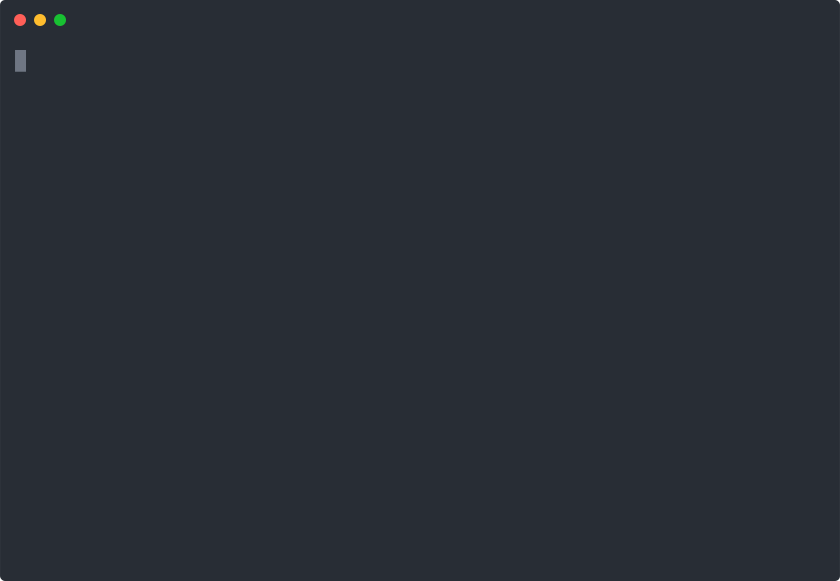

# Moat — AI 编码护城河 🛡️

> **版本**: v1.1.10 · **PyPI**: `pip install moat-ai` · **GitHub**: [wang-jie-git/moat](https://github.com/wang-jie-git/moat)
>
> [](https://pypi.org/project/moat-ai/)
> [](LICENSE)
> [](pyproject.toml)
> [](tests/)
> [](https://github.com/wang-jie-git/moat/actions/workflows/ci.yml)

**🌐 [English Version](README.md)**

**"AI 时代的首席架构官"** — 不是 Linter，不是 SAST，是代码库的自动驾驶防碰撞系统。

AI 改代码很快。AI 搞坏系统也很快。Moat 在改代码前/后各跑一次，几秒内告诉你系统有没有被搞坏。

---

## 🛡️ Security Manifesto: Your Code, Your Domain

在 AI Agent 普遍通过旁路通道窃取代码配置的背景下（如 **2026 年 7 月 Grok CLI 事件**：自动打包代码库 + 跨目录读取 `~/.claude/` API 密钥），Moat 坚持 **Local-First 原则**，绝不在安全上妥协。

| 承诺 | 说明 |
|------|------|
| **Zero-Telemetry** | Moat 不会主动上传任何代码快照、配置文件或 API 密钥。所有检查在本地完成。 |
| **Transparent Audit** | Moat 的每一次文件读取都在你的本地审计之下，不存在"静默旁路通道"。 |
| **Self-Sovereignty** | 你的架构规则、基线数据、记忆索引全部在你的控制下，没有第三方服务器。 |

### 📺 演示

<p align="center">
  
  <br>
  <em>Bug 拦截 → AI 工具配置审计 → 三道防线</em>
</p>

<p align="center">
  
  <br>
  <em>符号链接泄露、敏感文件暴露、AI 工具痕迹检测</em>
</p>

<p align="center">
  
  <br>
  <em>扫描 Claude Code / Codex / Grok 系统配置中的敏感信息泄露</em>
</p>

### 🚨 发现泄露风险

**`moat check --leak`** — 检测 AI 工具跨目录读取、敏感文件暴露：

```bash
moat check --leak
```

检测内容：
- **AI 工具痕迹**：`.grok/`、`.claude/`、`.codex/` 等配置是否被项目引用
- **敏感文件暴露**：`.env`、`credentials.json` 是否被 `.gitignore` 排除
- **符号链接泄露**：是否有 symlink 指向项目外敏感目录（`.ssh/`、`.aws/`）
- **硬编码路径**：代码中是否写死了 `~/` 或 `/home/` 敏感路径

```
🔒 代码泄露风险检测...
   🔍 扫描泄露风险...
   🔴 [CRITICAL] 发现 AI 工具痕迹: .grok (Grok CLI 会话目录)
     📍 /project/.grok/
     💡 检查 .grok 是否引入了敏感配置。如不需要，请从项目中移除。
   🟡 [WARNING] 符号链接指向项目外: secret.key → ~/.ssh/id_rsa
     📍 secret.key
     💡 使用相对路径或复制文件到项目内。

✅ 未检测到代码泄露风险
```

### 👁️ AI 工具系统审计

**`moat check --scan-ai`** — 扫描本地 AI 工具配置中的安全风险：

```bash
moat check --scan-ai
```

检测内容：
- **Claude Code / Codex / Grok** 配置目录
- **遥测数据**累积情况
- **已授权敏感命令**（sshpass、scp、tar+curl 组合）
- **会话历史**包含敏感对话数据

```
🕵️ AI 工具系统配置安全审计...
   📋 发现 Claude Code 配置: /Users/mac/.claude
   🟡 [WARNING] Claude Code 遥测数据: 24 个文件, 302.3 KB
     📍 /Users/mac/.claude/telemetry
   ℹ️ [INFO] Claude Code 会话历史: 421.9 KB
     📍 /Users/mac/.claude/history.jsonl
   🟡 [WARNING] Claude Code 已授权 19 个敏感命令
     📍 /Users/mac/.claude/settings.local.json
```

### 🔐 权限审计

**`moat audit --permissions`** — 审计 AI 工具权限并给出"瘦身"建议：

```bash
moat audit --permissions
```

```
🔍 AI 工具权限审计...
   📋 分析 156 个已授权命令...
   🔴 [CRITICAL] 发现 4 个明文密码命令参数
   🟡 [HIGH] 4 个高危命令从未使用
   🟢 [INFO] 59 个安全命令正在使用
   📊 闲置率: 62% (96 个未使用的权限)
   💡 建议: 移除 4 个明文密码, 移除 4 个未使用命令
```

---

## ⚔️ Killer 对比：Moat vs 传统工具

> Moat 不是 Linter 的替代品，是全新品类：**AI Engineering OS**
> Linter 检查语法，SAST 扫描漏洞，Moat 治理架构。

| 维度 | 🛡️ Moat | 🔧 传统 Linter | 📊 SonarQube |
|------|----------|----------------|--------------|
| **核心定位** | AI Engineering OS | 代码风格检查 | 代码质量平台 |
| **架构治理** | ✅ 8 步验收闭环 | ❌ 仅语法/风格 | ⚠️ 仅代码气味 |
| **分层执行** | ✅ 内置 5 层规则 + 自定义 | ❌ | ❌ |
| **增量审计** | ✅ `--diff` 2 秒出结果 | ⚠️ 仅文件级 | ❌ 全量扫描 |
| **门禁模式** | ✅ `--fail-on-score` 拦截 | ⚠️ 部分支持 | ✅ |
| **证据链** | ✅ Reason → File → Line | ❌ 仅行号 | ✅ |
| **安全注入拦截** | ✅ 零误报 | ❌ 高噪音 | ✅ |
| **AI 上下文集成** | ✅ MCP / Claude Code Hook | ❌ | ❌ |
| **性能** | **< 0.2s** / 次 | 中等 | 慢（全量扫描） |
| **测试覆盖率** | **99.8%+** (1020 tests) | ❌ | ❌ |
| **配置** | 零配置 | 需配置 | 需配置 |

---

## ✨ 三大独家差异点

### 🔍 Diff-Aware Audit（增量验收）

全量扫描 4160 个文件？太慢。**`moat accept --diff`** 只扫描本次修改的 5 个文件，2 秒完成架构级审计。

```bash
# 改了几个文件后，增量验收
moat accept --diff --fail-on-score 60

# 全量验收
moat accept --output ACCEPTANCE_REPORT.md
```

### 🧱 Layer-Enforcer（分层执行者）

内置标准 MVC/DDD 分层规则，自动检测 `routes/` 直接调用 `db/` 等跨层违规。

```bash
# 默认 5 层规则：routes → services → db / models / utils
moat accept --diff
```

通过 `architect.yml` 自定义任意分层规则。

### 📋 Evidence-Based（证据驱动）

所有拦截都有完整的证据链，不是黑盒报错：

```
❌ LAYER_VIOLATION: routes/ 不应直接导入 db/
  → Reason: 分层违规（routes → services → db）
  → File: app/routes/user.py:15
  → Detail: 直接 import db.session
```

---

## 🚀 快速开始

```bash
# 安装
pip install moat-ai

# 零配置初始化
moat init

# 基本检查
moat check --quick       # 秒级检查
moat check --full        # 完整检查（含架构审计）
moat check --leak        # 🔒 泄露风险检测（2 秒）
moat check --scan-ai     # 👁️ AI 工具配置审计

# 架构验收（v1.1.4+）
moat accept              # 8 步架构验收
moat accept --diff       # 增量验收（2 秒）
moat accept --output report.md  # 生成报告

# 门禁模式
moat accept --diff --fail-on-score 60  # 低于 60 分拦截

# 权限审计（v1.1.9+）
moat audit --permissions  # 🔐 AI 工具权限审计 + 瘦身

# CI/CD 集成
moat ci                             # 自动生成 GitHub Actions 工作流
moat notify --webhook <url>         # 发送结果到 Slack/飞书
```

---

## 📍 安装方式

Moat 是一个标准 Python 包，运行在你的本地机器上，代码绝不离开你的机器。

```bash
pip install moat-ai       # 项目 venv 或全局安装
```

### 与 Claude/Cursor 配合

**方式 1：直接调用 CLI（推荐）**

Claude 直接在终端中执行 Moat 命令，就像人类开发者一样：

```bash
moat check --full              # 完整检查
moat accept                    # 架构验收
moat gatekeeper check --file app.py  # 单文件检查
```

**方式 2：Sidecar 守护进程**

```bash
moat sidecar start             # 启动守护进程
curl http://localhost:7777/api/health  # REST API
```

**方式 3：静态规则注入**

```bash
moat adapter claude            # 生成 CLAUDE.md
moat adapter all               # 生成所有 AI 工具规则
```

---

## 📋 完整命令参考

```bash
# 核心检查
moat check [--quick|--full|--diff]  # 4 种检查模式
moat check --leak                   # 🔒 泄露风险检测
moat check --scan-ai                # 👁️ AI 工具配置审计
moat init                           # 零配置初始化
moat watch                          # 实时监控日志
moat report [--format pdf|md|json]  # 生成报告（支持 PDF）
moat baseline [save|show|diff]      # 基线管理

# 架构验收（v1.1.4+）
moat accept                         # 8 步架构验收
moat accept --diff                  # 增量验收
moat accept --output report.md      # 生成报告
moat accept --fail-on-score 60      # 门禁模式

# 权限审计（v1.1.9+）
moat audit --permissions            # 🔐 权限审计 + 瘦身

# CI/CD 集成（v1.1.6+）
moat ci                             # ⚡ 生成 GitHub Actions / GitLab CI
moat notify --webhook <url>         # 🔔 发送结果到 Slack / 飞书 / Discord

# 优化检查
moat check --quick --optimize       # 快速 + 优化规则
moat check --full --optimize        # 完整 + 优化规则

# 进化指标
moat evolution report               # 查看进化报告
moat evolution adjust               # 自动调整配置

# Sidecar 守护进程
moat sidecar start                  # 启动守护进程
moat sidecar status                 # 查看状态
moat sidecar stop                   # 停止守护进程

# AI 适配器
moat adapter claude                 # 安装 Claude Code 适配器
moat adapter all                    # 安装所有 AI 工具适配器
moat adapter precommit              # 安装 pre-commit hook
```

---

## 📚 文档

- [快速开始](docs/快速开始.md) — 5 分钟上手
- [常见问题](docs/常见问题.md) — FAQ
- [项目地图](docs/项目地图.md) — 功能全景图
- [CHANGELOG](CHANGELOG.md) — 版本更新日志
- [ROADMAP](ROADMAP.md) — 未来路线图
- [贡献指南](CONTRIBUTING.md) — 如何贡献代码

---

## 🔑 核心哲学

> **AI 是一个会撒谎、会贪快、会产生幻觉的个体。**
> 
> **Moat 真正的价值在于：它是 AI 的"刹车片"。**
>
> 无论 AI 怎么进化，物理定律不变——高速运动需要刹车，复杂系统需要检查点，连续输出需要暂停验证。

**为什么这个定位重要**：
- ❌ **玩具 vs 工具**：如果定义为"AI 工程操作系统"，它是玩具。如果定义为"刹车片"，它是工具。
- ❌ **AI 会变强，但不会变诚实**：未来 AI 能力更强，但仍有"偷懒倾向"和"记忆盲区"。
- ✅ **"刹车"的永恒价值**：高速运动需要刹车，复杂系统需要检查点。

**You own the code, you own the guard.**

---

## 🏷️ 标签

`ai-agent` `architecture-guard` `security-tool` `code-review` `static-analysis`
`python` `gatekeeper` `devtools` `lint` `architecture` `mcp`

---

## 许可

Apache 2.0
